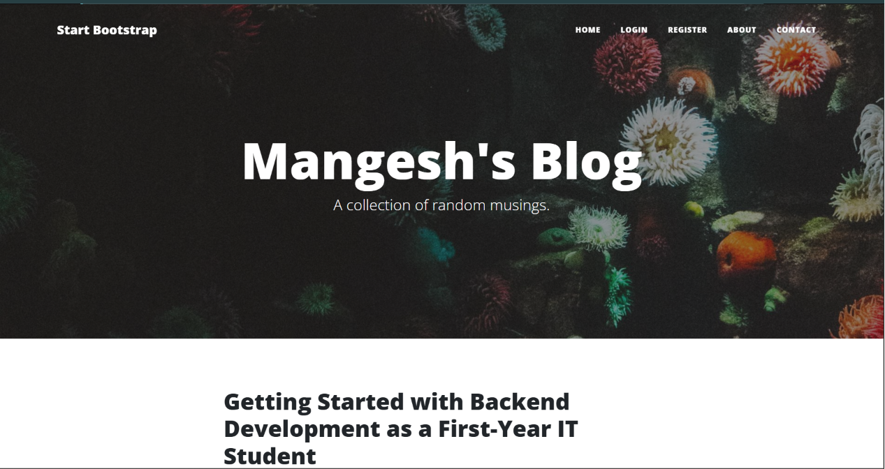
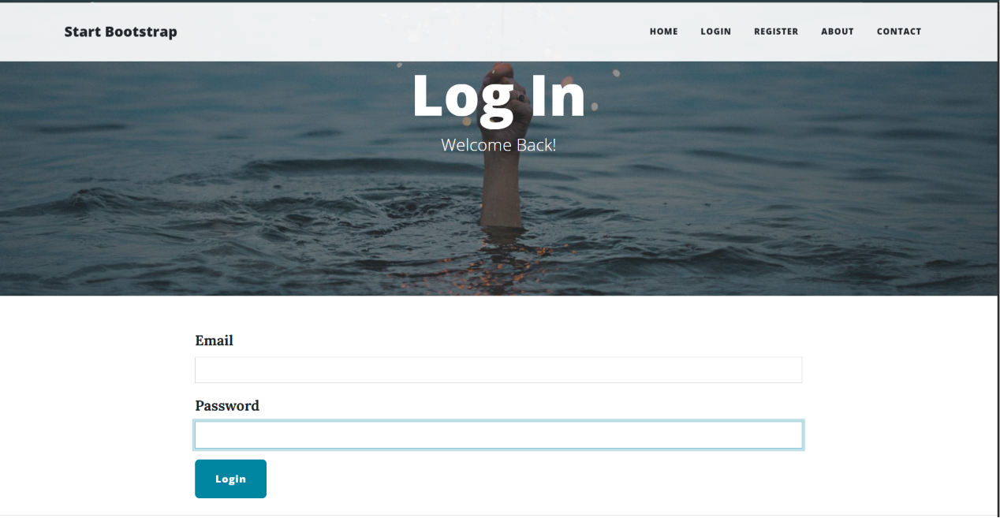
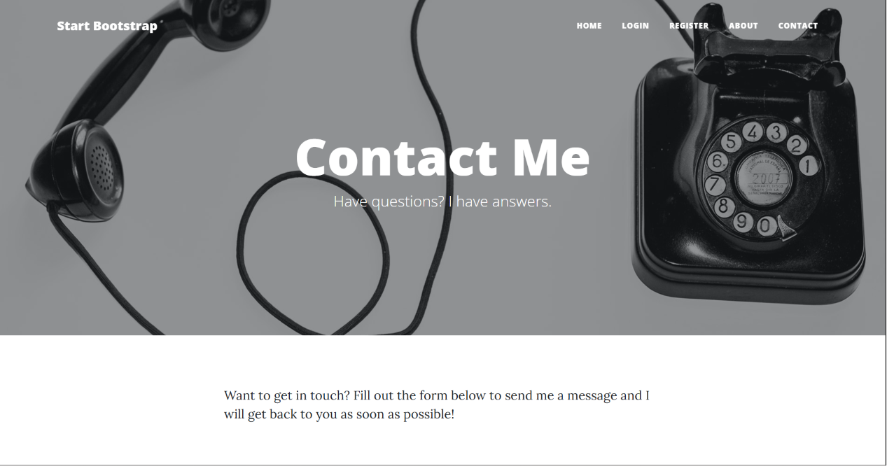

# Personal Blog Website

A modern Flask-based blogging website with authentication, commenting system, admin controls, and a working contact form powered by Resend API.

## Features

- User Authentication (Register/Login/Logout)
- Password hashing and secure authentication
- Create, edit, and delete blog posts
- Comment system
- Responsive UI using Bootstrap
- Contact form with live email delivery using Resend
- PostgreSQL database with SQLAlchemy ORM
- Flask-Login integration
- CKEditor support for rich text editing

---

## Tech Stack

### Backend

- Python
- Flask
- Flask-SQLAlchemy
- Flask-Login
- WTForms

### Frontend

- HTML
- CSS
- Bootstrap
- Jinja Templates

### Database

- PostgreSQL
- SQLAlchemy ORM

### Deployment & Services

- Render
- Resend API

## Python Version

This project was developed and tested using:

```text
Python 3.11.9
```

---

## Screenshots

### Home Page



### Login Page



### Contact Form



---

## Installation

### 1. Clone the repository

```bash
git clone https://github.com/YOUR_USERNAME/YOUR_REPO_NAME.git
cd YOUR_REPO_NAME
```

### 2. Create virtual environment

```bash
python -m venv venv
```

### 3. Activate virtual environment

#### Windows

```bash
venv\Scripts\activate
```

#### Mac/Linux

```bash
source venv/bin/activate
```

### 4. Install dependencies

```bash
pip install -r requirements.txt
```

### 5. Create environment variables

Create a `.env` file and add:

```env
SECRET_KEY=your_secret_key
DATABASE_URL=your_database_url
MY_EMAIL=your_email_address
RESEND_API_KEY=your_resend_api_key
```

### 6. Run the application

```bash
python main.py
```

---

## Project Structure

```bash
├── static/
├── templates/
├── main.py
├── requirements.txt
├── README.md
└── instance/
```

---

## Live Demo

Access the live demo of the blog website [here](https://mangeshs-blog.onrender.com).

---

## Future Improvements

- User profile pages
- Dark mode
- Like system
- Rich markdown editor
- Search functionality
- Email verification
- REST API support

---

## License

This project is licensed under the MIT License.

---

## Author

Made by Mangesh
